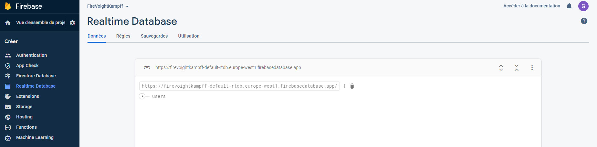

# Voight Kampff test : PHASE 3 - Temps réel
Les agents peuvent suivre en direct les réponses faites sur les questionnaires. La surveillance est totale, précise et immédiate. Big Mama is watching you !

Jetons un oeil à ce que nous pouvons faire.

## Real time DB, GO GO !
1 - Créez une base sur la console de Firebase. Il faut changer son nom en 'users' comme sur l'image.


2 - Travailler dans l'application
On va se donner un service dédié : `ng g s utils/services/suivi` dans lequel nous allons importer les classes utiles de Angularfire : `import { Database, objectVal, ref, set } from '@angular/fire/database';`
- Database est le point de référence vers la base de données en temps réel de Firebase `constructor(private rt:Database) {}`
- objectVal est une méthode qui va faire le suivi sur les données
- ref sert à insérer des données
- set et une méthode d'insertion

Nous avons besoin d'une méthode de suivi des données et d'une autre pour les écrire :
- la méthode pour le suivi des données, elle se déclenchera à chaque changement dans les données
```
getRTDB() {
    objectVal<any>(ref(this.rt, 'users')).subscribe(
      d => {
        for(let s in d){
          this.suivi.push(d[s]);
        }
      }
    );
  }
```
- une méthode pour écrire dans la base. Comme vous le voyez, elle nécessite de lire le 'uid' de l'utilisateur :
```
setRTDB(msg:any){
    msg['uid'] = this.auth.compte.uid;
    set(ref(this.rt, 'users/'+this.auth.compte.uid), msg);
  }
```
C'est pas plus compliqué que ça. Il nous suffit d'utiliser ces méthodes aux bons endroits.
Pour le suivi des changements sur la base, nous utiliserons un espace dédié aux agents.
L'écriture des données seront faites dans les formulaires remplis à chaque choix.